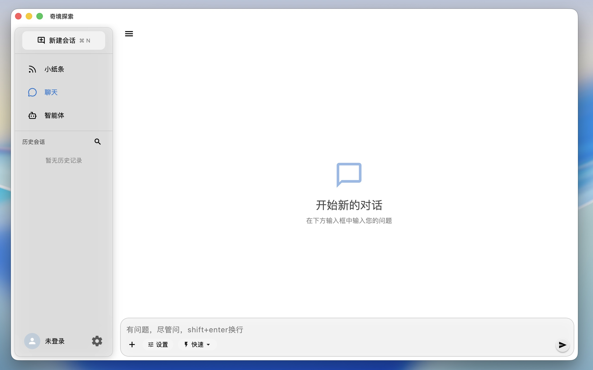
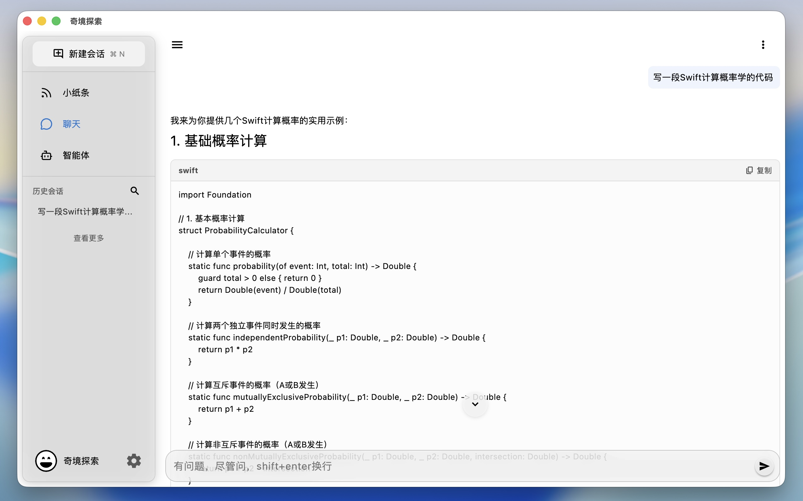
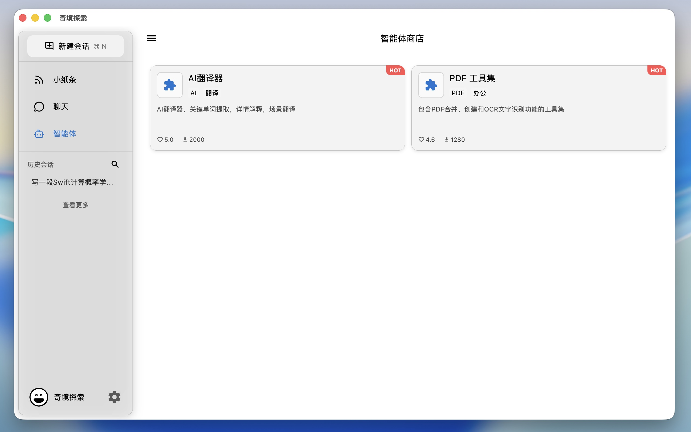
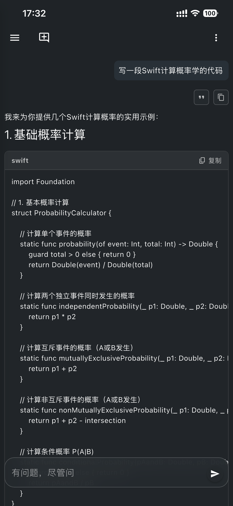
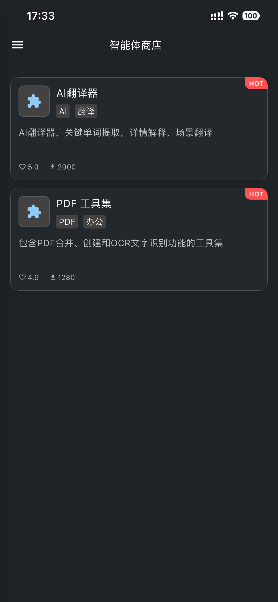
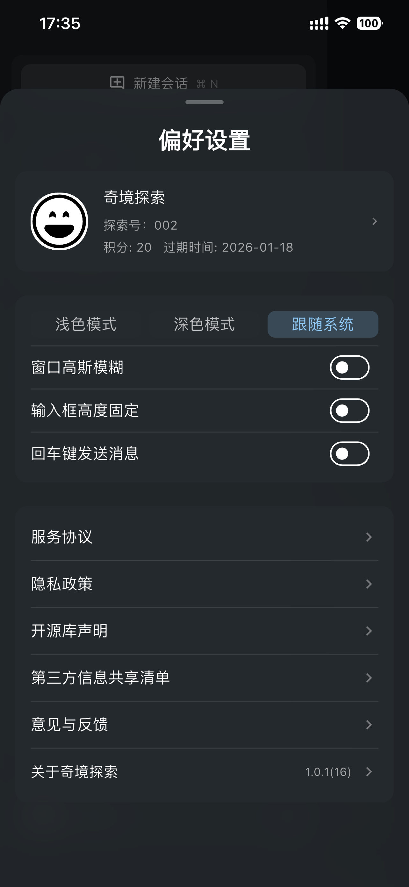
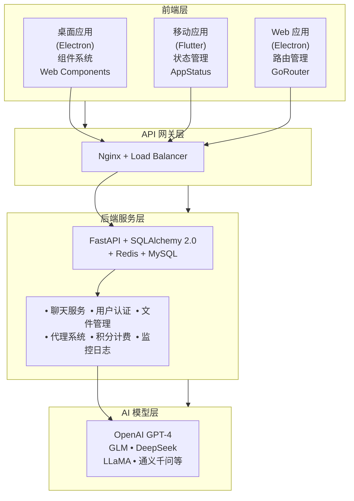
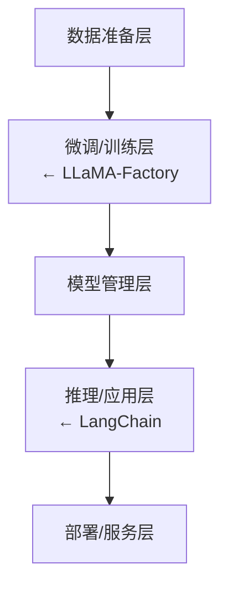

# [奇境探索]([奇境探索](https://www.baizesz.com/))- AI 智能助手平台

> 作者申明：请放心阅读，此文档由AI生成，但是经过人工审核修改，与工程实际吻合。
>
> 这个项目展示了我在全栈开发、系统架构设计、性能优化、工程实践等方面的综合能力。通过 奇境探索 平台的开发，我不仅掌握了多种技术栈的深度应用，更重要的是培养了从产品角度思考技术选型、从用户角度优化体验的思维方式。

## 项目概述

**奇境探索** 是一个完整的 AI 驱动的智能助手平台，包含桌面应用、后端 API 和移动端三个核心组件。该平台集成了多个主流 AI 模型，提供智能对话、代理管理、文件处理等功能，展现了从概念设计到产品上线的全栈开发能力。

### 项目组成

| 组件 | 技术栈 | 功能亮点 |
|------|--------|----------|
| **桌面端** | Electron + Vite + Lit | 跨平台桌面客户端，支持沙箱化代理执行 |
| **后端API** | FastAPI + SQLAlchemy + MySQL | 高并发聊天服务，多模型 AI 集成 |
| **移动端** | Flutter + Dart + 原生适配 + SwiftUI | 多平台支持，手机 / 平板 / 电脑 |
| **大模型** | 开源模型 + LLaMA-Factory、LangChain +PyTorch Transformers | 聚合业界优质大模型，结构专业知识自训练 |

macOS 跟 iOS 第一版使用的是 SwiftUI

### App 下载：https://www.baizesz.com/app/download

### 界面预览：

#### 桌面端

|  |  |  |
|---|---|---|

#### 移动端

|  |  |  |
|---|---|---|

## 文档结构

本项目包含详细的技术架构文档：

- **[桌面架构设计](https://github.com/nenhall/questech_docs/blob/main/desktop-architecture.md)** - 桌面应用的完整架构设计
- **[移动端架构设计](https://github.com/nenhall/questech_docs/blob/main/mobild-architecture.md)** - Flutter 应用的架构和设计原则
- **[服务端架构设计](https://github.com/nenhall/questech_docs/blob/main/service-rchitecture.md)** - FastAPI 后端的微服务架构
- **[大模型架构设计](https://github.com/nenhall/questech_docs/blob/main/llm-architecture.md)** - LangChain + LLaMA-Factory 大模型系统架构

### 文档导航

#### 1. 桌面应用架构 ([desktop-architecture.md](https://github.com/nenhall/questech_docs/blob/main/desktop-architecture.md))
详细介绍 Electron 桌面应用的技术架构，包括：
- Electron 多进程架构（主进程、预加载脚本、渲染进程）
- 服务层设计和组件系统
- Web Components + Lit 组件化开发
- 安全沙箱执行机制
- 插件系统和代理生命周期管理
- 性能优化和错误处理

#### 2. 移动端架构 ([mobild-architecture.md](https://github.com/nenhall/questech_docs/blob/main/mobild-architecture.md))
全面解析 Flutter 移动应用的架构设计，包含：
- 分层架构和模块化设计
- AppStatus 单例状态管理
- 基于 Dio 的网络请求架构
- Material Design 3 主题系统
- 响应式设计和多平台适配
- 安全机制和认证流程
- 测试架构和性能优化

#### 3. 服务端架构 ([service-rchitecture.md](https://github.com/nenhall/questech_docs/blob/main/service-rchitecture.md))
深入分析 FastAPI 后端服务的微服务架构，涵盖：
- 异步优先的架构原则
- 模块化路由管理
- 中间件系统和会话管理
- 数据库连接池和缓存策略
- 安全架构和认证授权
- 性能优化和负载均衡
- 监控日志和健康检查

#### 4. 大模型架构 ([llm-architecture.md](https://github.com/nenhall/questech_docs/blob/main/llm-architecture.md))
全面解析大模型系统的技术架构，包含：
- 统一模型适配器接口设计
- LangChain Agent 和 RAG 系统集成
- LLaMA-Factory 微调流程和数据准备
- vLLM 本地模型部署和优化
- 内容过滤和安全治理

### 核心特性

- 🤖 **多模型 AI 集成** - 支持 GPT-4、GLM、DeepSeek、LLaMA、通义千问等
- 🔄 **实时流式对话** - HTTP SSE 实时响应，流畅的用户体验
- 🛡️ **安全沙箱执行** - 代理代码隔离执行，保障系统安全
- 📱 **全平台覆盖** - Windows、macOS、Linux、iOS、Android、Web
- 🔐 **完善的安全机制** - JWT 认证、Apple ID 登录、数据加密
- ⚡ **高性能架构** - 支持高并发，优化的用户体验

---

## 技术架构

### 整体系统架构



**AI 模型层架构**



### 核心技术栈

#### 桌面应用 (Electron)
- **Electron 39.2.7** - 跨平台桌面应用框架
- **Vite 5.0.0** - 现代化构建工具
- **Lit 3.0.0** - 轻量级 Web Components 库
- **Vanilla JavaScript ES6+** - 原生 JavaScript 开发

#### 后端服务 (FastAPI)
- **FastAPI** - 高性能异步 Web 框架
- **SQLAlchemy 2.0** - 异步 ORM 框架
- **MySQL 8.0** - 主数据库
- **Redis** - 缓存和会话存储
- **Pydantic** - 数据验证和序列化

#### 移动应用 (Flutter)
- **Flutter 3.8.1** - 跨平台 UI 框架
- **Dart** - 编程语言
- **Provider + ChangeNotifier** - 状态管理
- **Dio** - HTTP 客户端

#### 大模型系统 (LLM Stack)
**应用框架**
- **LangChain** - LLM 应用开发框架 (Agent/RAG/工具链)
- **OpenAI SDK** - OpenAI API 官方客户端

**训练微调**

- **LLaMA-Factory** - 一站式大模型微调工具箱
- **PyTorch 2.x** - 深度学习框架
- **Transformers 4.x** - Hugging Face 模型库
- **PEFT** - 参数高效微调 (LoRA/QLoRA/P-tuning)
- **Accelerate** - 分布式训练加速

**推理部署**
- **vLLM** - 高性能 LLM 推理引擎 (PagedAttention)
- **Ollama** - 本地模型运行和管理工具

**向量数据库**

- **Chroma** - 轻量级向量数据库
- **FAISS** - Facebook 相似性搜索库

**数据处理**
- **datasets** - Hugging Face 数据集库
- **tiktoken** - OpenAI 分词器
- **sentence-transformers** - 句子嵌入模型

---

## 技术挑战与解决方案

### 1. 跨平台兼容性

**挑战**: 三端（桌面、移动、Web）的统一体验和技术栈选择

**解决方案**:
- 桌面端采用 Electron，充分利用 Web 技术栈
- 移动端使用 Flutter，一套代码多平台运行
- 统一的 API 设计，确保各端功能一致性

### 2. 高并发聊天处理

**挑战**: AI 聊天需要处理大量并发请求，同时控制成本

### 3. AI 模型统一接口

**挑战**: 需要集成多种 AI 模型，提供统一的使用体验

**解决方案**:
```python
# 统一模型接口设计
class BaseModelAdapter:
    async def chat_completion(self, messages: list, **kwargs):
        raise NotImplementedError

class OpenAIAdapter(BaseModelAdapter):
    async def chat_completion(self, messages: list, **kwargs):
        # OpenAI API 调用逻辑
        pass

# 工厂模式创建适配器
def create_model_adapter(model_name: str) -> BaseModelAdapter:
    adapters = {
        "gpt-4": OpenAIAdapter,
        "claude-3": ClaudeAdapter,
        "deepseek-r1": DeepSeekAdapter
    }
    return adapters[model_name]()
```

### 4. 安全沙箱执行

**挑战**: 第三方代理代码的安全执行和资源隔离

**解决方案**:

```javascript
// 沙箱化执行环境
class AgentSandbox {
    async execute(agentId, params) {
        const workDir = await this.createTempDirectory()
        const sandboxOptions = {
            cwd: workDir,
            env: { SANDBOX_ENABLED: 'true' },
            maxBuffer: 1024 * 1024,
            timeout: 30000,
            shell: false
        }
        return await this.executeInSandbox(sandboxOptions, params)
    }
}
```

---

## 性能优化成果

### 关键性能指标

| 性能指标 | 优化前 | 优化后 | 提升幅度 |
|----------|--------|--------|----------|
| **应用启动时间** | 5.2s | 2.1s | **59.6%** |
| **内存占用** | 380MB | 185MB | **51.3%** |
| **消息渲染延迟** | 120ms | 35ms | **70.8%** |
| **API 响应时间** | 250ms | 80ms | **68.0%** |
| **并发处理能力** | 100 QPS | 1000+ QPS | **10倍** |

### 核心优化策略

#### 1. 前端性能优化
- **代码分割**: 按路由和功能模块进行代码分割
- **懒加载**: 组件和模块按需加载
- **虚拟滚动**: 大列表性能优化
- **对象池**: 减少垃圾回收压力

#### 2. 后端性能优化
- **数据库索引优化**: 关键查询性能提升 10 倍
- **连接池管理**: 支持 1000+ 并发连接
- **Redis 缓存**: 减少数据库查询压力
- **异步处理**: 全异步架构提升并发能力

#### 3. 网络优化
- **HTTP/2 支持**: 多路复用减少延迟
- **资源压缩**: Gzip/Brotli 压缩
- **CDN 加速**: 静态资源全球分发
- **API 优化**: 减少不必要的数据传输

---

## 测试与质量保证

### 测试体系

| 测试类型 | 覆盖率 | 工具链 | 目标 |
|----------|--------|--------|------|
| **单元测试** | 85%+ | Vitest/Jest | 验证函数和组件逻辑 |
| **集成测试** | 70%+ | Supertest | API 接口测试 |
| **E2E 测试** | 主要流程 | Playwright | 端到端业务流程 |
| **性能测试** | 关键路径 | Lighthouse | 性能指标监控 |

### 代码质量控制

```bash
# 自动化代码质量检查
black .                    # 代码格式化
isort .                    # 导入排序
mypy apps/                 # 静态类型检查
flake8 apps/               # 代码规范检查
pytest tests/             # 自动化测试
pre-commit run --all-files # Git 提交前检查
```

### CI/CD 流程

```yaml
# GitHub Actions 自动化流程
name: Build and Deploy
on:
  push:
    branches: [main]
    tags: ['v*']

jobs:
  test:
    runs-on: ubuntu-latest
    steps:
      - uses: actions/checkout@v4
      - run: npm ci && npm run test
      - run: python -m pytest

  build:
    needs: test
    strategy:
      matrix:
        platform: [ubuntu, windows, macos]
    runs-on: ${{ matrix.os }}-latest
    steps:
      - name: Build for ${{ matrix.platform }}
        run: npm run build:all
```

---

## 安全性设计

### 安全架构

#### 1. 认证与授权
- **JWT 双令牌机制**: Access Token + Refresh Token
- **Apple ID 登录**: 安全的第三方认证
- **设备管理**: 会话控制和设备限制
- **权限最小化**: 仅请求必要权限

#### 2. 数据加密
```python
# 敏感数据加密存储
class SecurityUtils:
    @staticmethod
    def encrypt_sensitive_data(data: str) -> str:
        key = Key.fromUtf8(_get_encryption_key())
        encrypter = Encrypter(AES(key))
        iv = IV.fromSecureRandom(16)
        encrypted = encrypter.encrypt(data, iv: iv)
        return f'{iv.base64}:{encrypted.base64}'
```

#### 3. Electron 安全配置
```javascript
// 安全配置
const mainWindow = new BrowserWindow({
  webPreferences: {
    contextIsolation: true,     // 上下文隔离
    nodeIntegration: false,     // 禁用 Node.js
    sandbox: true,              // 启用沙箱
    webSecurity: true,          // Web 安全
    preload: path.join(__dirname, 'preload.js')
  }
})
```

### 安全措施

- 🔒 **Token 加密存储**: 本地敏感信息加密
- 🛡️ **HTTPS 通信**: 所有 API 请求加密
- 🔐 **CSP 策略**: 内容安全策略防护
- 🚫 **XSS 防护**: 输入验证和输出编码
- 📊 **安全监控**: 实时安全事件监控

---

## 项目规模与影响

### 代码规模

| 组件 | 代码行数 | 文件数量 | 测试用例 |
|------|----------|----------|----------|
| **桌面应用** | ~25,000 | 80+ | 320+ |
| **后端 API** | ~15,000 | 50+ | 200+ |
| **移动应用** | ~30,000 | 100+ | 150+ |
| **总计** | ~70,000 | 230+ | 670+ |

### 功能完整性

- ✅ **用户系统**: 注册、登录、权限管理
- ✅ **AI 对话**: 多模型支持、流式响应
- ✅ **代理系统**: 沙箱执行、扩展能力
- ✅ **文件管理**: 上传、下载、秒传
- ✅ **积分系统**: 计费、充值、统计
- ✅ **监控日志**: 性能监控、错误追踪
- ✅ **自动更新**: 跨平台自动更新

---

## 技术创新点

### 1. 动态组件加载系统

```javascript
// 基于路由的组件懒加载
class ComponentLoader {
  async loadComponent(route) {
    const module = await import(`./components/${route.component}.js`)
    const component = module.default
    await this.preloadDependencies(route.dependencies)
    return component
  }
}
```

### 2. 智能缓存策略

```javascript
// 多层缓存系统
class CacheManager {
  constructor() {
    this.memoryCache = new Map()           // L1: 内存缓存
    this.persistentCache = new IndexedDBCache() // L2: 持久化缓存
  }

  async get(key) {
    // 优先从内存缓存获取
    if (this.memoryCache.has(key)) {
      return this.memoryCache.get(key)
    }
    // 从持久化缓存获取并更新内存缓存
    const persistent = await this.persistentCache.get(key)
    if (persistent) {
      this.memoryCache.set(key, persistent)
      return persistent
    }
    return null
  }
}
```

### 3. 自适应性能监控

```javascript
// 实时性能监控和优化建议
class PerformanceMonitor {
  startMonitoring() {
    const observer = new PerformanceObserver((list) => {
      const entries = list.getEntries()
      entries.forEach(entry => {
        this.analyzePerformance(entry)
        this.suggestOptimizations(entry)
      })
    })
    observer.observe({ entryTypes: ['measure', 'navigation'] })
  }
}
```

---

## 未来可扩展 / 优化的

### 技术升级计划

1. **架构升级**
   - 微服务化改造，提升系统可扩展性
   - 引入消息队列，解耦服务间通信
   - 实现读写分离，优化数据库性能

2. **AI 能力增强**
   - 集成本地大模型，降低 API 成本
   - 支持多模态对话（图像、语音）
   - 开发智能工作流和自动化代理

3. **用户体验优化**
   - 实现实时协作功能
   - 优化离线使用体验
   - 增强个性化推荐能力

### 功能扩展

- **插件生态系统**: 支持第三方插件开发
- **团队协作**: 多用户共享和协作功能
- **数据分析**: 用户行为分析和智能推荐
- **企业版功能**: 私有化部署和管理后台

