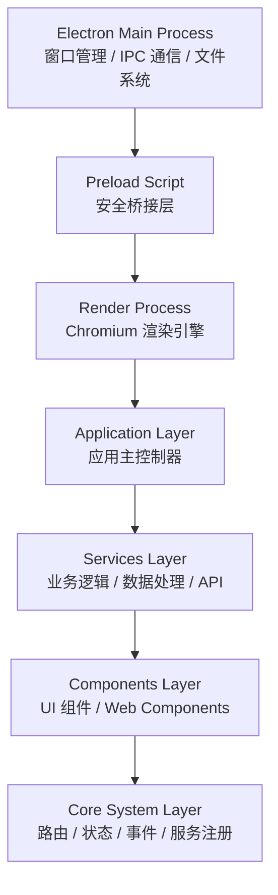
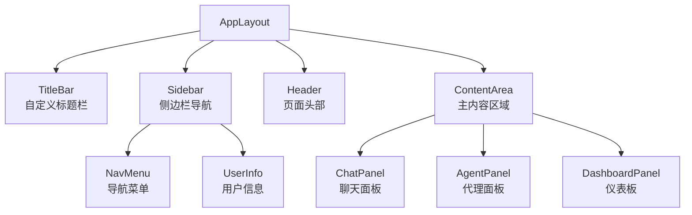
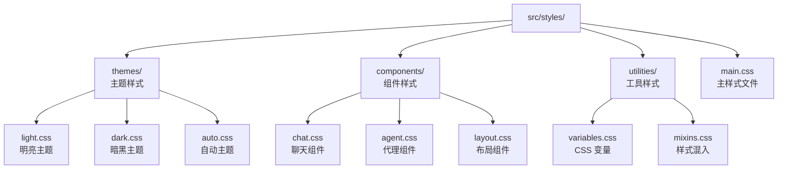

# 架构设计

## 整体架构概览

奇境探索桌面应用采用分层架构设计，结合了 Electron 的多进程能力和现代前端架构模式，实现了高性能、可维护的桌面应用。

### 架构层次图



## 核心架构组件

### 1. Electron 多进程架构

#### Main Process (主进程)
```javascript
// electron/main.js
const { app, BrowserWindow, ipcMain } = require('electron')

class ElectronMain {
  constructor() {
    this.windows = new Map()
    this.setupIPC()
  }

  createWindow() {
    // 创建和管理窗口
  }

  setupIPC() {
    // 设置 IPC 通信
  }
}
```

**职责:**
- 窗口生命周期管理
- 系统级 API 调用
- 文件系统访问
- 进程间通信 (IPC)
- 自动更新机制

#### Preload Script (预加载脚本)
```javascript
// electron/preload.js
const { contextBridge, ipcRenderer } = require('electron')

contextBridge.exposeInMainWorld('electronAPI', {
  // 安全地暴露主进程 API
  openFile: () => ipcRenderer.invoke('dialog:openFile'),
  saveFile: (data) => ipcRenderer.invoke('dialog:saveFile', data)
})
```

**职责:**
- 安全桥接主进程和渲染进程
- 暴露受限的 API 给渲染进程
- 实现 Context Bridge 安全机制

### 2. 应用核心架构

#### App.js - 应用主控制器
```javascript
// src/App.js
class App {
  constructor() {
    this.services = new ServiceRegistry()
    this.eventBus = new EventBus()
    this.stateManager = new StateManager()
    this.router = new Router()
  }

  async initialize() {
    await this.registerServices()
    await this.setupRoutes()
    await this.loadTheme()
  }
}
```

**核心功能:**
- 服务注册和管理
- 事件系统初始化
- 路由配置
- 主题管理
- 错误处理

### 3. 服务层架构

#### Service Registry (服务注册容器)
```javascript
// src/core/ServiceRegistry.js
class ServiceRegistry {
  constructor() {
    this.services = new Map()
    this.singletons = new Map()
  }

  register(name, factory, options = {}) {
    this.services.set(name, { factory, options })
  }

  get(name) {
    // 实现依赖注入和单例模式
  }
}
```

**注册的服务:**
- `apiService` - API 通信服务
- `agentService` - 代理管理服务
- `chatService` - 聊天服务
- `themeService` - 主题管理服务
- `storageService` - 数据存储服务

#### 服务示例 - AgentService
```javascript
// src/services/agent/AgentService.js
class AgentService {
  constructor(apiService, storageService) {
    this.api = apiService
    this.storage = storageService
    this.agents = new Map()
  }

  async installAgent(agentConfig) {
    // 代理安装逻辑
  }

  async executeAgent(agentId, params) {
    // 代理执行逻辑
  }
}
```

### 4. 组件架构

#### Web Components + Lit
```javascript
// src/components/chat/ChatPanel.js
import { LitElement, html, css } from 'lit'

class ChatPanel extends LitElement {
  static styles = css`
    :host {
      display: block;
      height: 100%;
    }
  `

  static properties = {
    messages: { type: Array },
    isLoading: { type: Boolean }
  }

  render() {
    return html`
      <div class="chat-container">
        ${this.renderMessages()}
        ${this.renderInput()}
      </div>
    `
  }
}
```

**组件层次结构:**



### 5. 路由系统

#### Client-side Router
```javascript
// src/core/Router.js
class Router {
  constructor() {
    this.routes = new Map()
    this.currentRoute = null
  }

  addRoute(path, component) {
    this.routes.set(path, component)
  }

  navigate(path) {
    const component = this.routes.get(path)
    if (component) {
      this.renderComponent(component)
    }
  }
}
```

**路由配置:**
```javascript
// src/router/index.js
const routes = {
  '/': 'dashboard-panel',
  '/chat': 'chat-panel',
  '/agents': 'agent-panel',
  '/agents/:id': 'agent-detail',
  '/settings': 'settings-panel'
}
```

## 数据流架构

### 事件驱动架构
```javascript
// src/core/EventBus.js
class EventBus {
  constructor() {
    this.events = new Map()
  }

  on(event, callback) {
    // 注册事件监听器
  }

  emit(event, data) {
    // 触发事件
  }

  off(event, callback) {
    // 移除事件监听器
  }
}
```

### 状态管理
```javascript
// src/core/StateManager.js
class StateManager {
  constructor(eventBus) {
    this.state = {}
    this.subscribers = new Map()
    this.eventBus = eventBus
  }

  setState(key, value) {
    this.state[key] = value
    this.notifySubscribers(key, value)
    this.eventBus.emit('state:change', { key, value })
  }

  getState(key) {
    return this.state[key]
  }
}
```

## 插件系统架构

### Agent Interface
```javascript
// src/services/agent/AgentInterface.js
class AgentInterface {
  constructor(config) {
    this.id = config.id
    this.name = config.name
    this.version = config.version
    this.entry = config.entry
  }

  async install() {
    // 安装逻辑
  }

  async execute(params) {
    // 执行逻辑
  }

  async uninstall() {
    // 卸载逻辑
  }
}
```

### 代理生命周期管理
```javascript
// src/services/agent/AgentLifecycleManager.js
class AgentLifecycleManager {
  constructor() {
    this.runningAgents = new Map()
    this.agentConfigs = new Map()
  }

  async startAgent(agentId) {
    // 启动代理
  }

  async stopAgent(agentId) {
    // 停止代理
  }

  async restartAgent(agentId) {
    // 重启代理
  }
}
```

## 安全架构

### 1. 进程隔离
- 主进程和渲染进程分离
- Context Bridge 安全通信
- 沙箱模式运行

### 2. 权限控制
```javascript
// 安全权限配置
const securityConfig = {
  nodeIntegration: false,
  contextIsolation: true,
  enableRemoteModule: false,
  webSecurity: true,
  allowRunningInsecureContent: false,
  experimentalFeatures: false
}
```

### 3. 数据验证
```javascript
// src/utils/validation.js
class InputValidator {
  static sanitizeHTML(input) {
    // HTML 清理
  }

  static validateJSON(data) {
    // JSON 验证
  }
}
```

## UI 架构

### 主题系统
```javascript
// src/services/theme/ThemeManager.js
class ThemeManager {
  constructor() {
    this.currentTheme = 'auto'
    this.themes = new Map()
  }

  loadTheme(name) {
    // 加载主题
  }

  applyTheme(theme) {
    // 应用主题
  }
}
```

### CSS 架构



## 模块加载策略

### 懒加载
```javascript
// src/core/ComponentLoader.js
class ComponentLoader {
  async loadComponent(name) {
    if (!this.loadedComponents.has(name)) {
      const module = await import(`./components/${name}.js`)
      this.loadedComponents.set(name, module.default)
    }
    return this.loadedComponents.get(name)
  }
}
```

### 代码分割
```javascript
// vite.config.js
export default {
  build: {
    rollupOptions: {
      output: {
        manualChunks: {
          vendor: ['lit', 'marked'],
          electron: ['electron'],
          utils: ['./src/utils']
        }
      }
    }
  }
}
```

## 通信架构

### IPC 通信
```javascript
// 主进程处理器
ipcMain.handle('agent:execute', async (event, agentId, params) => {
  return await agentManager.execute(agentId, params)
})

// 渲染进程调用
const result = await window.electronAPI.agent.execute(agentId, params)
```

### REST API 集成
```javascript
// src/services/api/APIService.js
class APIService {
  constructor(baseURL) {
    this.baseURL = baseURL
    this.interceptors = []
  }

  async request(endpoint, options = {}) {
    // HTTP 请求处理
  }

  addInterceptor(interceptor) {
    // 拦截器管理
  }
}
```

## 性能架构

### 1. 资源管理
- 内存监控和清理
- 组件生命周期管理
- 图片懒加载

### 2. 渲染优化
```javascript
// 虚拟滚动
class VirtualScroller {
  constructor(container, itemHeight, renderItem) {
    this.container = container
    this.itemHeight = itemHeight
    this.renderItem = renderItem
  }

  render(items) {
    // 只渲染可见区域
  }
}
```

### 3. 缓存策略
```javascript
// src/services/cache/CacheManager.js
class CacheManager {
  constructor() {
    this.cache = new Map()
    this.maxSize = 100
  }

  set(key, value, ttl = 300000) {
    // 缓存设置
  }

  get(key) {
    // 缓存获取
  }
}
```

## 错误处理架构

### 全局错误捕获
```javascript
// src/core/ErrorHandler.js
class ErrorHandler {
  constructor() {
    this.setupErrorHandlers()
  }

  setupErrorHandlers() {
    window.addEventListener('error', this.handleError.bind(this))
    window.addEventListener('unhandledrejection', this.handlePromiseRejection.bind(this))
  }

  handleError(error) {
    // 错误处理和上报
  }
}
```

### 日志系统
```javascript
// src/utils/logger.js
class Logger {
  static log(level, message, data = {}) {
    // 结构化日志记录
  }

  static error(message, error) {
    this.log('ERROR', message, { error: error.stack })
  }
}
```

---

*此架构文档详细说明了 奇境探索 的技术架构设计，为开发者提供了系统性的技术理解。*

**最后更新**: 2025-12-22