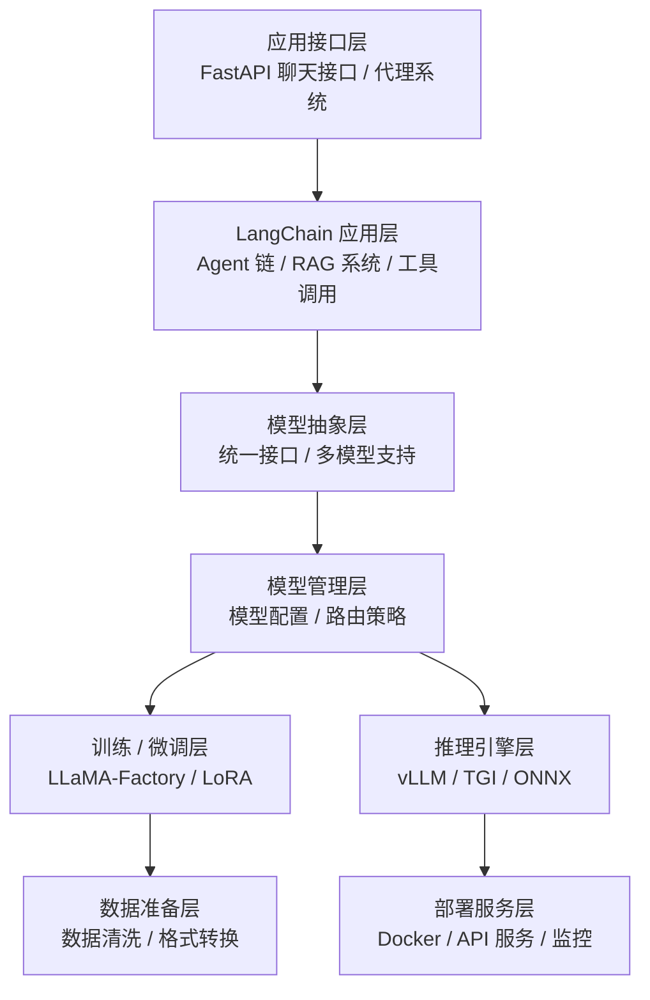
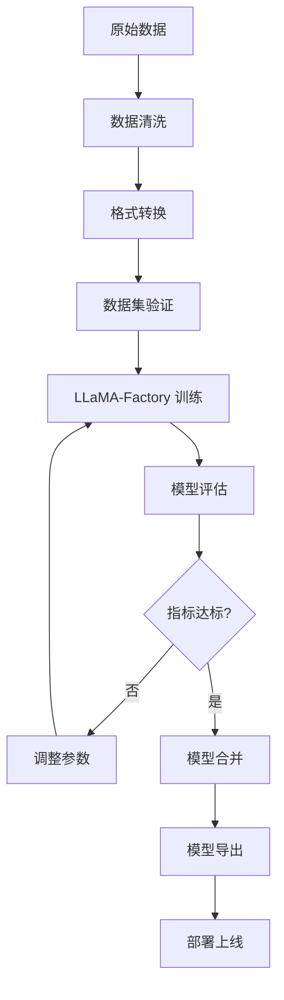
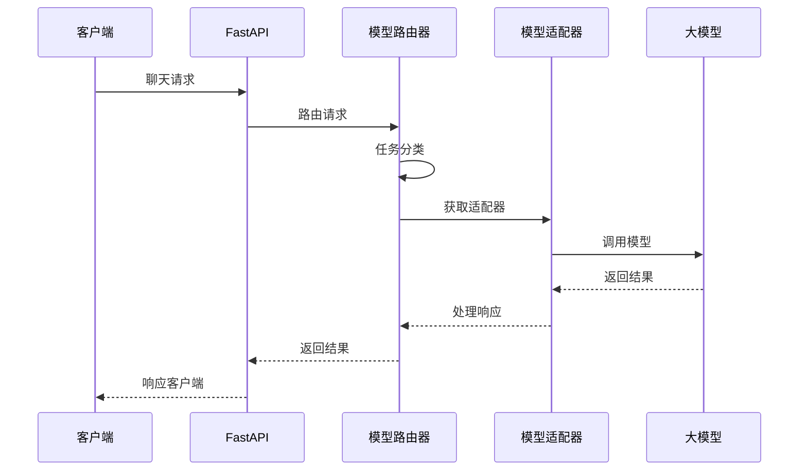
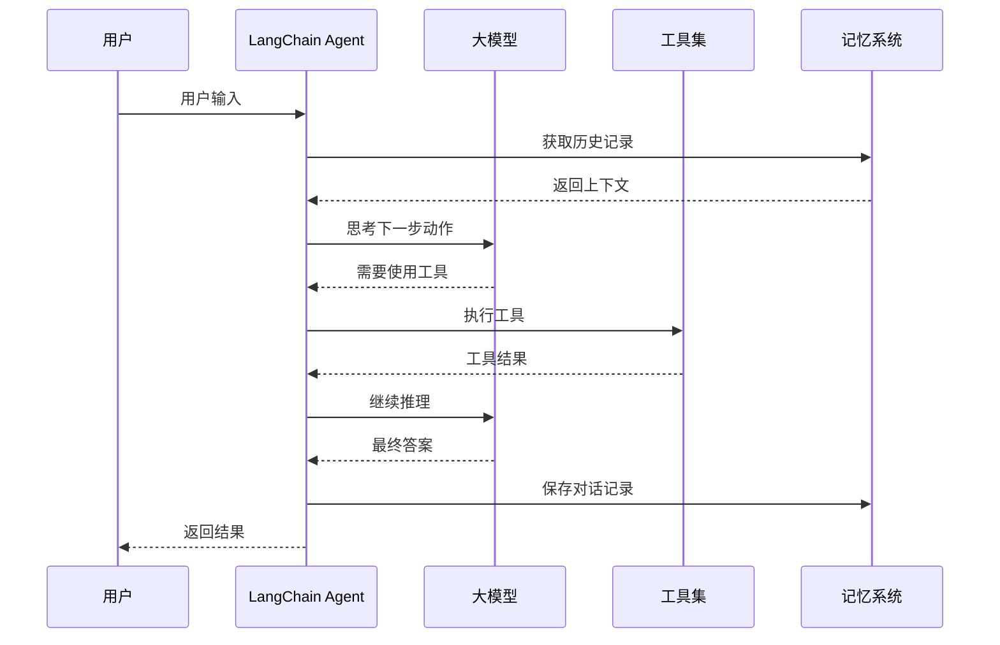

# 大模型架构设计

## 整体架构概览

奇境探索的大模型系统采用模块化、可扩展的架构设计，集成了业界主流的开源工具和框架，实现了从数据准备、模型训练、模型管理到推理应用的完整链路。

### 架构层次图



## 技术栈

### 核心框架
- **LangChain 0.1.x** - LLM 应用开发框架
- **LangSmith** - LLM 应用调试和监控平台
- **LLaMA-Factory** - 大模型微调工具箱

### 训练框架
- **PyTorch 2.x** - 深度学习框架
- **Transformers 4.x** - Hugging Face 模型库
- **PEFT** - 参数高效微调库 (LoRA/QLoRA)
- **Accelerate** - 分布式训练加速

### 推理优化
- **vLLM** - 高性能 LLM 推理引擎
- **bitsandbytes** - 量化推理支持
- **OpenAI SDK** - OpenAI API 客户端

### 数据处理
- **datasets** - Hugging Face 数据集库
- **pandas** - 数据处理和分析
- **tokenizers** - 高效分词器

## 架构原则

### 1. 统一抽象接口

所有 AI 模型通过统一的适配器接口进行访问：

```python
# apps/intelligent/adapters/base.py
from abc import ABC, abstractmethod
from typing import AsyncIterator, Optional

class BaseModelAdapter(ABC):
    """基础模型适配器接口"""

    def __init__(self, config: ModelConfig):
        self.config = config
        self.model_name = config.model_name

    @abstractmethod
    async def chat_completion(
        self,
        messages: list[dict],
        stream: bool = False,
        **kwargs
    ) -> AsyncIterator[str] | dict:
        """聊天补全接口"""
        pass

    @abstractmethod
    async def embed(self, text: str) -> list[float]:
        """文本嵌入接口"""
        pass

    @abstractmethod
    def get_token_count(self, text: str) -> int:
        """计算 Token 数量"""
        pass
```

### 2. 适配器模式实现

```python
# apps/intelligent/adapters/openai_adapter.py
import openai
from typing import AsyncIterator

class OpenAIAdapter(BaseModelAdapter):
    """OpenAI 模型适配器"""

    def __init__(self, config: ModelConfig):
        super().__init__(config)
        self.client = openai.AsyncOpenAI()

    async def chat_completion(self, **kwargs) -> AsyncIterator[str] | dict:
        if stream:
            return self._stream_completion(messages, **kwargs)
        return await self._non_stream_completion(messages, **kwargs)

    async def _stream_completion()

    async def _non_stream_completion()
```

### 3. 工厂模式管理

```python
# apps/intelligent/adapters/factory.py
from typing import Dict, Type

class ModelAdapterFactory:
    """模型适配器工厂"""

    _adapters: Dict[str, Type[BaseModelAdapter]] = {
        # OpenAI 系列
        "gpt-4": OpenAIAdapter,
        ...

        # 国产模型
        "deepseek-chat": DeepSeekAdapter,
        ...

        # 开源模型 (本地部署)
        "llama-3-xb": LocalModelAdapter,
        ...
    }

    @classmethod
    def create_adapter(cls, model_name: str, config: ModelConfig) -> BaseModelAdapter:
        """创建模型适配器"""
        adapter_class = cls._adapters.get(model_name)

        if not adapter_class:
            # 尝试模糊匹配

        return adapter_class(config)

    @classmethod
    def register_adapter(cls, model_name: str, adapter_class: Type[BaseModelAdapter]):
        """注册新的模型适配器"""
        cls._adapters[model_name] = adapter_class
```

## 核心组件

### 1. 模型路由管理器

```python
# apps/intelligent/model_router.py
class ModelRouter:
    """智能模型路由器"""

    def __init__(self):
        self.model_configs = {}
        self.load_balancer = LoadBalancer()
        self.fallback_chain = FallbackChain()

    async def route_request(
        self,
        user_request: ChatRequest,
        context: RequestContext
    ) -> BaseModelAdapter:
        """根据请求路由到合适的模型"""

        # 1. 检查用户指定的模型
        if user_request.model:
            return self.get_adapter(user_request.model)

        # 2. 根据任务类型自动选择
        task_type = self.classify_task(user_request.messages)

        # 3. 考虑成本和性能
        if context.requirements.get('low_latency'):
            return self.get_adapter('gpt-3.5-turbo')

        if context.requirements.get('high_quality'):
            return self.get_adapter('gpt-4-turbo')

        # 4. 默认选择
        return self.get_adapter('gpt-3.5-turbo')

    def classify_task(self, messages: list[dict]) -> str:
        """任务分类逻辑"""
        # 实现任务分类逻辑
        last_message = messages[-1]['content'].lower()

        if any(keyword in last_message for keyword in ['code', '编程', '函数']):
            return 'coding'

        if any(keyword in last_message for keyword in ['翻译', 'translate', '英文']):
            return 'translation'

        return 'general'
```

### 2. LangChain 集成架构

#### Agent 系统

```python
# apps/intelligent/agents/base_agent.py
from langchain.agents import AgentExecutor, create_openai_functions_agent
from langchain.prompts import ChatPromptTemplate, MessagesPlaceholder
from langchain.tools import Tool

class LangChainAgentManager:
    """LangChain Agent 管理器"""

    def __init__(self, llm_adapter, tool_registry):
        self.llm = self._create_langchain_llm(llm_adapter)
        self.tool_registry = tool_registry
        self.executors = {}

    def _create_langchain_llm(self, adapter):
        """将自定义适配器包装为 LangChain LLM"""
        from langchain.llms.base import LLM
        from typing import Optional, List, Any

        class CustomLLM(LLM):
            def __init__(self, adapter):
                self.adapter = adapter

            @property
            def _llm_type(self) -> str:
                return "custom"

            def _call(self, prompt: str, stop: Optional[List[str]] = None) -> str:
                # 同步调用
                import asyncio
                return asyncio.run(self._acall(prompt, stop))

            async def _acall(self, prompt: str, stop: Optional[List[str]] = None) -> str:
                messages = [{"role": "user", "content": prompt}]
                response = await self.adapter.chat_completion(messages, stream=False)
                return response['choices'][0]['message']['content']

        return CustomLLM(adapter)

    async def create_agent(self, agent_id: str, tools: list[str]):
        """创建 Agent"""
        # 获取工具
        agent_tools = [self.tool_registry.get_tool(name) for name in tools]

        # 创建 Prompt
        prompt = ChatPromptTemplate.from_messages([
            ("system", "You are a helpful assistant."),
            MessagesPlaceholder(variable_name="chat_history"),
            ("human", "{input}"),
            MessagesPlaceholder(variable_name="agent_scratchpad")
        ])

        # 创建 Agent
        agent = create_openai_functions_agent(self.llm, agent_tools, prompt)
        executor = AgentExecutor(agent=agent, tools=agent_tools, verbose=True)

        self.executors[agent_id] = executor
        return executor

    async def execute_agent(self, agent_id: str, input_text: str, chat_history: list = None):
        """执行 Agent"""
        executor = self.executors.get(agent_id)
        if not executor:
            raise ValueError(f"Agent {agent_id} not found")

        result = await executor.ainvoke({
            "input": input_text,
            "chat_history": chat_history or []
        })

        return result['output']
```

#### RAG 系统

```python
# apps/intelligent/rag/base.py
from langchain.text_splitter import RecursiveCharacterTextSplitter
from langchain_community.vectorstores import Chroma
from langchain_community.embeddings import OpenAIEmbeddings
from langchain.chains import RetrievalQA

class RAGSystem:
    """检索增强生成系统"""

    def __init__(self, llm_adapter, vector_store_config):
        self.llm = self._create_langchain_llm(llm_adapter)
        self.embeddings = OpenAIEmbeddings()
        self.text_splitter = RecursiveCharacterTextSplitter(
            chunk_size=1000,
            chunk_overlap=200,
            length_function=len
        )
        self.vector_store = None

    async def initialize_vector_store(self, documents: list[str]):
        """初始化向量存储"""
        from langchain.docstore.document import Document

        docs = [
            Document(page_content=doc, metadata={"index": i})
            for i, doc in enumerate(documents)
        ]

        # 分割文本
        splits = self.text_splitter.split_documents(docs)

        # 创建向量存储
        self.vector_store = await Chroma.afrom_documents(
            documents=splits,
            embedding=self.embeddings,
            persist_directory="./chroma_db"
        )

    async def query(self, question: str, k: int = 4) -> str:
        """查询 RAG 系统"""
        if not self.vector_store:
            return "No knowledge base available"

        # 检索相关文档
        docs = await self.vector_store.asimilarity_search(question, k=k)

        # 构建上下文
        context = "\n\n".join([doc.page_content for doc in docs])

        # 使用 LLM 生成答案
        qa_chain = RetrievalQA.from_chain_type(
            llm=self.llm,
            chain_type="stuff",
            retriever=self.vector_store.as_retriever(search_kwargs={"k": k})
        )

        result = await qa_chain.ainvoke({"query": question})
        return result['result']
```

### 3. LLaMA-Factory 训练流程

#### 数据准备

```python
# scripts/llm/data_preparation.py
import pandas as pd
from datasets import Dataset

class DataPreparer:
    """训练数据准备器"""

    def __init__(self):
        self.data_formats = {
            'alpaca': self._prepare_alpaca_format,
            'instruction': self._prepare_instruction_format,
            'conversation': self._prepare_conversation_format
        }

    def prepare_dataset(
        self,
        data_path: str,
        output_path: str,
        format_type: str = 'alpaca'
    ):
        """准备训练数据集"""
        # 加载原始数据
        raw_data = pd.read_json(data_path)

        # 转换格式
        prepare_func = self.data_formats[format_type]
        formatted_data = prepare_func(raw_data)

        # 保存为 JSONL
        formatted_data.to_json(output_path, orient='records', lines=True)

        # 同时保存为 Hugging Face Dataset 格式
        dataset = Dataset.from_pandas(formatted_data)
        dataset.save_to_disk(output_path.replace('.jsonl', '_dataset'))

    def _prepare_alpaca_format(self, data: pd.DataFrame) -> pd.DataFrame:
        """Alpaca 格式"""
        return pd.DataFrame({
            'instruction': data['question'],
            'input': '',
            'output': data['answer']
        })

    def _prepare_conversation_format(self, data: pd.DataFrame) -> pd.DataFrame:
        """对话格式"""
        conversations = []
        for _, row in data.iterrows():
            conversations.append([
                {'role': 'user', 'content': row['question']},
                {'role': 'assistant', 'content': row['answer']}
            ])

        return pd.DataFrame({'conversations': conversations})
```

#### 微调配置

```yaml
# configs/llama_factory/qlora_config.yaml
### 模型相关
model_name: path/to/base/model  # 基础模型路径
model_type: llama               # 模型类型

### 方法相关
finetuning_type: lora          # 微调类型
lora_target: all               # LoRA 目标层
lora_rank: 8                   # LoRA 秩
lora_alpha: 16                 # LoRA alpha
lora_dropout: 0.05             # LoRA dropout

### 量化相关 (QLoRA)
quantization_bit: 4            # 量化位数 (4-bit)
quantization_type: nf4         # 量化类型 (nf4/fp4)
double_quantization: true      # 双重量化

### 数据集相关
dataset: dataset_name          # 数据集名称
template: llama3               # 模板类型
cutoff_len: 1024              # 最大序列长度
overwrite_cache: true         # 覆盖缓存
preprocessing_num_workers: 16 # 数据预处理线程数

### 输出相关
output_dir: saves/finetuned_model  # 输出目录
logging_steps: 10             # 日志记录步数
save_steps: 500              # 保存步数
plot_loss: true              # 绘制损失曲线
overwrite_output_dir: true   # 覆盖输出目录

### 训练相关
per_device_train_batch_size: 4    # 每个 GPU 的训练批次大小
gradient_accumulation_steps: 4    # 梯度累积步数
learning_rate: 5.0e-5            # 学习率
num_train_epochs: 3.0            # 训练轮数
lr_scheduler_type: cosine        # 学习率调度器
warmup_ratio: 0.1                # 预热比例
bf16: true                       # 使用 BF16
ddp_timeout: 180000000           # DDP 超时时间

### 验证相关
val_size: 0.1                   # 验证集比例
per_device_eval_batch_size: 2   # 每个 GPU 的评估批次大小
eval_strategy: steps           # 评估策略
eval_steps: 500                # 评估步数
```

#### 训练脚本

```python
# scripts/llm/train.py
import sys
sys.path.append('LLaMA-Factory')

from llmtuner import train

def start_training(config_path: str):
    """启动训练"""
    import yaml

    with open(config_path, 'r', encoding='utf-8') as f:
        config = yaml.safe_load(f)

    # 启动训练
    train(
        model_name=config['model_name'],
        finetuning_type=config['finetuning_type'],
        quantization_bit=config.get('quantization_bit'),
        dataset=config['dataset'],
        output_dir=config['output_dir'],
        per_device_train_batch_size=config['per_device_train_batch_size'],
        gradient_accumulation_steps=config['gradient_accumulation_steps'],
        learning_rate=config['learning_rate'],
        num_train_epochs=config['num_train_epochs'],
        # ... 其他参数
    )

if __name__ == '__main__':
    start_training('configs/llama_factory/qlora_config.yaml')
```

#### 模型导出

```python
# scripts/llm/export_model.py
from llmtuner import export_model

def export_to_merge(base_model_path: str, adapter_path: str, output_path: str):
    """导出并合并模型"""
    export_model(
        model_name_or_path=base_model_path,
        adapter_name_or_path=adapter_path,
        export_dir=output_path,
        export_size=2,        # 导出大小 (GB)
        export_device='cpu',  # 导出设备
        export_legacy_format=False  # 是否导出为旧格式
    )

# 使用示例
export_to_merge(
    base_model_path='models/llama-3-8b',
    adapter_path='saves/finetuned_model',
    output_path='models/merged_llama3_qa'
)
```

### 4. 本地模型部署

#### vLLM 部署

```python
# scripts/deploy/vllm_server.py
from vllm import LLM, SamplingParams
from fastapi import FastAPI
from pydantic import BaseModel

app = FastAPI()

# 初始化 vLLM 引擎
llm = LLM(
    model="models/merged_llama3_qa",
    quantization="awq",           # 量化方式
    tensor_parallel_size=2,       # 张量并行 GPU 数量
    max_model_len=4096,           # 最大序列长度
    trust_remote_code=True
)

class ChatRequest(BaseModel):
    messages: list[dict]
    temperature: float = 0.7
    max_tokens: int = 2048

@app.post("/v1/chat/completions")
async def chat_completion(request: ChatRequest):
    """聊天补全接口"""
    # 构建提示词
    prompt = build_prompt(request.messages)

    # 采样参数
    sampling_params = SamplingParams(
        temperature=request.temperature,
        max_tokens=request.max_tokens,
        top_p=0.9
    )

    # 生成
    outputs = llm.generate([prompt], sampling_params)

    # 返回结果
    return {
        "id": "chatcmpl-" + generate_id(),
        "object": "chat.completion",
        "created": int(time.time()),
        "model": "llama3-qm",
        "choices": [{
            "index": 0,
            "message": {
                "role": "assistant",
                "content": outputs[0].outputs[0].text
            },
            "finish_reason": "stop"
        }]
    }

if __name__ == "__main__":
    import uvicorn
    uvicorn.run(app, host="0.0.0.0", port=8000)
```

#### Docker 部署

```dockerfile
# Dockerfile
FROM nvidia/cuda:12.1.0-runtime-ubuntu22.04

RUN apt-get update && apt-get install -y \
    python3.10 \
    python3-pip \
    git \
    && rm -rf /var/lib/apt/lists/*

WORKDIR /app

COPY requirements.txt .
RUN pip3 install --no-cache-dir -r requirements.txt

COPY . .

EXPOSE 8000

CMD ["python3", "scripts/deploy/vllm_server.py"]
```

```yaml
# docker-compose.yml
version: '3.8'

services:
  vllm-server:
    build: .
    ports:
      - "8000:8000"
    environment:
      - CUDA_VISIBLE_DEVICES=0,1
    volumes:
      - ./models:/app/models:ro
    deploy:
      resources:
        reservations:
          devices:
            - driver: nvidia
              count: all
              capabilities: [gpu]
```

## 数据流架构

### 训练流程



### 推理流程



### LangChain Agent 流程



## 性能优化

### 1. 推理加速

#### vLLM 优化

```python
# vLLM 配置优化
llm = LLM(
    model="models/llama3-70b",
    # 张量并行
    tensor_parallel_size=4,

    # KV Cache 优化
    enable_prefix_caching=True,  # 启用前缀缓存
    swap_space=16,               # Swap 空间 (GB)

    # 批处理优化
    max_num_batched_tokens=8192,  # 最大批处理 Token 数
    max_num_seqs=256,              # 最大序列数

    # 量化
    quantization="awq",
    max_model_len=32768
)
```

#### 批处理优化

```python
# apps/intelligent/batch_processor.py
class BatchRequestProcessor:
    """批处理请求处理器"""

    def __init__(self, max_batch_size: int = 8, max_wait_time: float = 0.1):
        self.max_batch_size = max_batch_size
        self.max_wait_time = max_wait_time
        self.request_queue = asyncio.Queue()
        self.processing = False

    async def add_request(self, request):
        """添加请求到批处理队列"""
        future = asyncio.Future()
        await self.request_queue.put((request, future))
        return await future

    async def process_batch(self):
        """处理一批请求"""
        while True:
            # 收集一批请求
            batch = []
            start_time = time.time()

            while len(batch) < self.max_batch_size:
                try:
                    timeout = self.max_wait_time - (time.time() - start_time)
                    if timeout <= 0:
                        break

                    request, future = await asyncio.wait_for(
                        self.request_queue.get(),
                        timeout=timeout
                    )
                    batch.append((request, future))
                except asyncio.TimeoutError:
                    break

            if not batch:
                continue

            # 批量处理
            prompts = [req.messages for req, _ in batch]
            results = await self._batch_inference(prompts)

            # 返回结果
            for (_, future), result in zip(batch, results):
                future.set_result(result)
```

### 2. 缓存策略

#### 语义缓存

```python
# apps/intelligent/semantic_cache.py
from chromadb import Client as ChromaClient
from sentence_transformers import SentenceTransformer

class SemanticCache:
    """语义缓存系统"""

    def __init__(self, threshold: float = 0.95):
        self.embedder = SentenceTransformer('all-MiniLM-L6-v2')
        self.chroma_client = ChromaClient()
        self.collection = self.chroma_client.create_collection("semantic_cache")
        self.threshold = threshold

    async def get(self, query: str) -> str | None:
        """从缓存获取结果"""
        # 嵌入查询
        query_embedding = self.embedder.encode(query).tolist()

        # 搜索相似缓存
        results = self.collection.query(
            query_embeddings=[query_embedding],
            n_results=1
        )

        if results['distances'][0][0] > self.threshold:
            # 返回缓存结果
            cached_result = results['metadatas'][0][0]
            return cached_result['response']

        return None

    async def set(self, query: str, response: str):
        """保存到缓存"""
        query_embedding = self.embedder.encode(query).tolist()

        self.collection.add(
            embeddings=[query_embedding],
            metadatas=[{"response": response}],
            ids=[str(hash(query))]
        )
```

### 3. Token 优化

#### Token 计数与限制

```python
# apps/intelligent/token_manager.py
import tiktoken

class TokenManager:
    """Token 管理器"""

    def __init__(self):
        self.encoders = {}

    def get_encoder(self, model_name: str):
        """获取分词器"""
        if model_name not in self.encoders:
            # 根据模型选择编码器
            if 'gpt-4' in model_name:
                encoding = 'cl100k_base'
            elif 'gpt-3.5' in model_name:
                encoding = 'cl100k_base'
            else:
                encoding = 'cl100k_base'  # 默认

            self.encoders[model_name] = tiktoken.get_encoding(encoding)

        return self.encoders[model_name]

    def count_tokens(self, text: str, model_name: str) -> int:
        """计算 Token 数量"""
        encoder = self.get_encoder(model_name)
        tokens = encoder.encode(text)
        return len(tokens)

    def truncate_to_tokens(
        self,
        text: str,
        model_name: str,
        max_tokens: int
    ) -> str:
        """截断文本到指定 Token 数量"""
        encoder = self.get_encoder(model_name)
        tokens = encoder.encode(text)

        if len(tokens) <= max_tokens:
            return text

        truncated_tokens = tokens[:max_tokens]
        return encoder.decode(truncated_tokens)
```

## 监控与评估

### 1. LangSmith 集成

```python
# apps/intelligent/monitoring/langsmith_setup.py
import os
from langsmith import Client
from langchain.callbacks import LangChainTracer

# 初始化 LangSmith
os.environ["LANGCHAIN_TRACING_V2"] = "true"
os.environ["LANGCHAIN_API_KEY"] = "your-api-key"
os.environ["LANGCHAIN_PROJECT"] = "questech-llm"

langchain_client = Client()

class LLMMonitor:
    """LLM 监控器"""

    def __init__(self):
        self.tracer = LangChainTracer()

    async def trace_invocation(
        self,
        model_name: str,
        prompt: str,
        response: str,
        latency: float,
        metadata: dict = None
    ):
        """追踪模型调用"""
        langchain_client.create_run(
            name="llm_invocation",
            inputs={"prompt": prompt},
            outputs={"response": response},
            extra={
                "model_name": model_name,
                "latency": latency,
                **(metadata or {})
            }
        )
```

### 2. 性能指标监控

```python
# apps/intelligent/monitoring/metrics.py
from prometheus_client import Counter, Histogram, Gauge

# 定义指标
llm_requests_total = Counter(
    'llm_requests_total',
    'Total LLM requests',
    ['model_name', 'status']
)

llm_latency_seconds = Histogram(
    'llm_latency_seconds',
    'LLM request latency',
    ['model_name']
)

llm_tokens_total = Counter(
    'llm_tokens_total',
    'Total tokens processed',
    ['model_name', 'direction']  # direction: input/output
)

llm_active_requests = Gauge(
    'llm_active_requests',
    'Active LLM requests',
    ['model_name']
)

class LLMMetricsCollector:
    """LLM 指标收集器"""

    @staticmethod
    def record_request(model_name: str, status: str):
        """记录请求"""
        llm_requests_total.labels(model_name=model_name, status=status).inc()

    @staticmethod
    def record_latency(model_name: str, latency: float):
        """记录延迟"""
        llm_latency_seconds.labels(model_name=model_name).observe(latency)

    @staticmethod
    def record_tokens(model_name: str, input_tokens: int, output_tokens: int):
        """记录 Token 数量"""
        llm_tokens_total.labels(model_name=model_name, direction='input').inc(input_tokens)
        llm_tokens_total.labels(model_name=model_name, direction='output').inc(output_tokens)
```

## 安全与治理

### 1. 内容过滤

```python
# apps/intelligent/safety/content_filter.py
class ContentFilter:
    """内容过滤器"""

    def __init__(self):
        self.forbidden_patterns = [
            # 敏感词列表
        ]

    def filter_input(self, text: str) -> tuple[bool, str]:
        """过滤输入内容"""
        # 检查敏感词
        for pattern in self.forbidden_patterns:
            if pattern in text.lower():
                return False, "Content contains forbidden words"

        # 检查输入长度
        if len(text) > 10000:
            return False, "Input too long"

        return True, text

    def filter_output(self, text: str) -> tuple[bool, str]:
        """过滤输出内容"""
        # 类似的过滤逻辑
        return True, text
```

## 未来可扩展方向

### 1. 多模态支持
- 图像理解 (GPT-4V, LLaVA)
- 语音识别与合成 (Whisper, TTS)
- 视频理解

### 2. 模型压缩
- 剪枝 (Pruning)
- 知识蒸馏 (Knowledge Distillation)
- 量化 (Quantization)

### 3. 分布式训练
- FSDP (Fully Sharded Data Parallel)
- DeepSpeed
- Ray Train

### 4. 高级 RAG
- 混合检索 (稠密 + 稀疏)
- 重排序 (Reranking)
- 查询改写和扩展

---

*此架构文档详细说明了 奇境探索 的大模型系统架构设计，涵盖了从训练到部署的完整技术栈。*

**最后更新**: 2025-12-23
