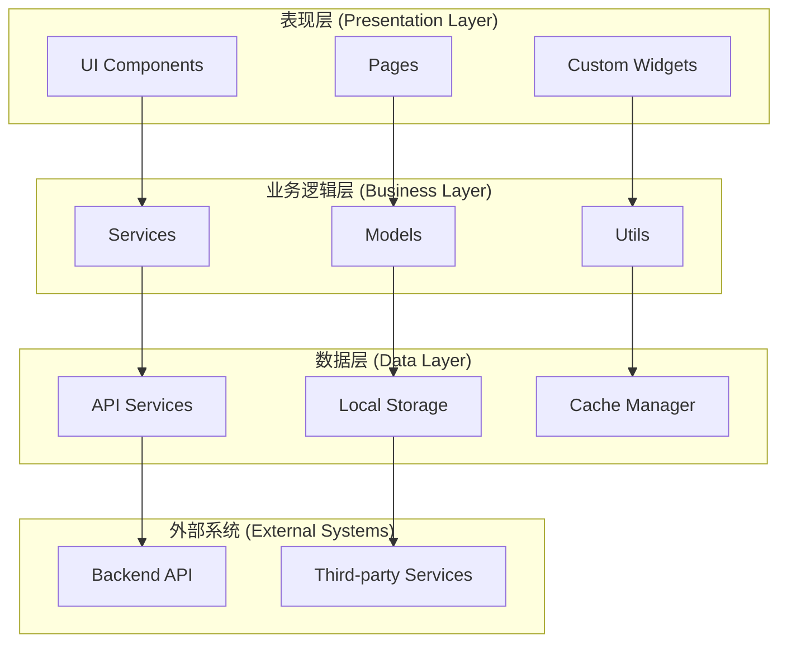
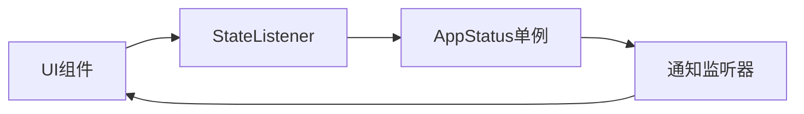
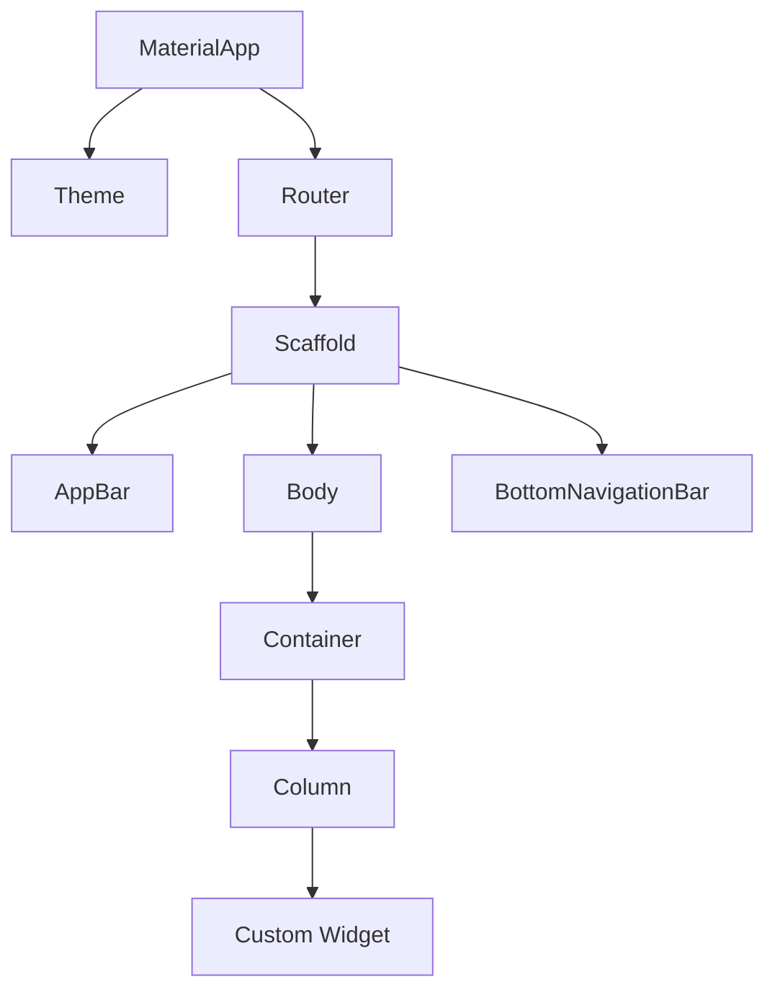
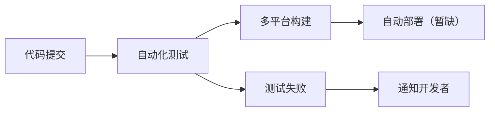

# 系统架构设计

本文档详细描述了奇境探索 (Questech) 应用的整体架构设计、技术选型和设计原则。

## 整体架构

### 架构概览
奇境探索采用 **分层架构** 和 **模块化设计**，确保代码的可维护性、可扩展性和可测试性。



### 核心设计原则
- **单一职责原则**: 每个模块只负责一个特定功能
- **开闭原则**: 对扩展开放，对修改封闭
- **依赖倒置**: 高层模块不依赖低层模块，都依赖抽象
- **接口隔离**: 使用小而专一的接口
- **DRY原则**: 避免重复代码

## 客户端架构

### 技术栈
- **框架**: Flutter 3.8.1+
- **语言**: Dart 3.8.1+
- **状态管理**: ListenableBuilder + AppStatus单例
- **UI框架**: Material Design 3
- **网络请求**: Dio 5.8.0+
- **本地存储**: SharedPreferences
- **依赖注入**: 手动依赖注入

### 目录结构
```
lib/
├── main.dart                    # 应用入口点
├── app.dart                     # 应用配置和初始化
├── config/                      # 配置模块
│   ├── api_config.dart          # API配置
│   ├── app_config.dart          # 应用配置
│   ├── chat_config.dart         # 聊天配置
│   └── index.dart
├── constants/                   # 常量定义
│   ├── app_colors.dart          # 颜色主题
│   ├── app_constants.dart       # 应用常量
│   ├── app_dimensions.dart      # 尺寸定义
│   └── index.dart
├── models/                      # 数据模型
│   ├── agent_models.dart        # 智能体模型
│   ├── app_status.dart          # 应用状态
│   ├── chat_models.dart         # 聊天模型
│   ├── chat_state.dart          # 聊天状态
│   ├── news_models.dart         # 资讯模型
│   └── perspectives_model.dart  # 视角分析模型
├── services/                    # 服务层
│   ├── agent_api.dart           # 智能体API
│   ├── chat_api.dart            # 聊天API
│   ├── http_service.dart        # HTTP服务
│   ├── token_manager.dart       # Token管理
│   ├── apple_login_handler.dart # Apple登录
│   ├── file_upload_service.dart # 文件上传
│   └── pdf_service.dart         # PDF服务
├── pages/                       # 页面组件
│   ├── chat_home_page.dart      # 聊天首页
│   ├── agent/                   # 智能体页面
│   ├── news_dashboard_page.dart # 资讯仪表盘
│   ├── ai_daily_list_page.dart  # AI日报
│   └── about_page.dart          # 关于页面
├── widgets/                     # 可复用组件
│   ├── side_bar.dart            # 侧边栏
│   ├── chat_input.dart          # 聊天输入框
│   ├── chat_list.dart           # 聊天列表
│   └── navigation_bar.dart      # 导航栏
├── dialogs/                     # 对话框
│   ├── login_dialog.dart        # 登录对话框
│   ├── settings_dialog.dart     # 设置对话框
│   └── model_selector_dialog.dart # 模型选择
└── utils/                       # 工具类
    ├── file_utils.dart          # 文件工具
    ├── date_utils.dart          # 日期工具
    └── validation_utils.dart    # 验证工具
```

## 状态管理架构

### AppStatus 单例模式
应用采用 **AppStatus** 单例来管理全局状态：

```dart
class AppStatus {
  static final AppStatus _instance = AppStatus._internal();
  factory AppStatus() => _instance;
  AppStatus._internal();

  // 用户状态
  User? _currentUser;
  bool _isLoggedIn = false;

  // 应用状态
  bool _isLoading = false;
  String _currentModel = 'deepseek-r1';
  ThemeMode _themeMode = ThemeMode.system;

  // 聊天状态
  List<ChatSession> _chatSessions = [];
  ChatSession? _currentChatSession;
}
```

### 状态更新流程


### 状态管理最佳实践
- **不可变性**: 状态对象尽量保持不可变
- **单一数据源**: 每个状态都有唯一的数据源
- **最小化状态**: 只存储必要的状态信息
- **状态分离**: 将UI状态和业务状态分离

## 网络架构

### HTTP服务设计
基于 Dio 封装的 HTTP 服务，提供统一的网络请求接口：

```dart
class HttpService {
  static final HttpService _instance = HttpService._internal();
  factory HttpService() => _instance;
  HttpService._internal();

  late Dio _dio;

  void init() {
    _dio = Dio(BaseOptions(
      baseUrl: ApiConfig.baseUrl,
      connectTimeout: Duration(seconds: 60),
      receiveTimeout: Duration(seconds: 60),
    ));

    // 添加拦截器
    _dio.interceptors.add(AuthInterceptor());
    _dio.interceptors.add(LogInterceptor());
  }
}
```

### API服务层
每个业务模块都有独立的 API 服务：

```dart
class ChatApiService {
  final HttpService _httpService = HttpService();

  Future<ApiResponse<List<ChatMessage>>> getChatHistory(String sessionId) async {
    try {
      final response = await _httpService.get('/chat/history/$sessionId');
      return ApiResponse.success(data: response.data);
    } catch (e) {
      return ApiResponse.error(message: e.toString());
    }
  }
}
```

### 请求拦截器
```dart
class AuthInterceptor extends Interceptor {
  @override
  void onRequest(RequestOptions options, RequestInterceptorHandler handler) {
    // 添加认证Token
    final token = TokenManager.getToken();
    if (token != null) {
      options.headers['Authorization'] = 'Bearer $token';
    }
    super.onRequest(options, handler);
  }

  @override
  void onError(DioException err, ErrorInterceptorHandler handler) {
    // 处理401错误，自动刷新Token
    if (err.response?.statusCode == 401) {
      TokenManager.refreshToken();
    }
    super.onError(err, handler);
  }
}
```

## UI架构

### 组件层次结构


### 响应式设计
采用 **LayoutBuilder** 和 **MediaQuery** 实现响应式布局：

```dart
class ResponsiveWidget extends StatelessWidget {
  final Widget mobile;
  final Widget tablet;
  final Widget desktop;

  const ResponsiveWidget({
    Key? key,
    required this.mobile,
    required this.tablet,
    required this.desktop,
  }) : super(key: key);

  @override
  Widget build(BuildContext context) {
    return LayoutBuilder(
      builder: (context, constraints) {
        if (constraints.maxWidth < 600) {
          return mobile;
        } else if (constraints.maxWidth < 1200) {
          return tablet;
        } else {
          return desktop;
        }
      },
    );
  }
}
```

### 主题系统
基于 Material Design 3 的主题系统：

```dart
class AppTheme {
  static ThemeData lightTheme = ThemeData(
    useMaterial3: true,
    colorScheme: ColorScheme.fromSeed(
      seedColor: AppColors.primary,
      brightness: Brightness.light,
    ),
  );

  static ThemeData darkTheme = ThemeData(
    useMaterial3: true,
    colorScheme: ColorScheme.fromSeed(
      seedColor: AppColors.primary,
      brightness: Brightness.dark,
    ),
  );
}
```

## 数据架构

### 本地存储
使用 SharedPreferences 存储简单的键值对数据：

```dart
class LocalStorage {
  static const String _tokenKey = 'auth_token';
  static const String _userKey = 'user_info';
  static const String _themeKey = 'theme_mode';

  static Future<void> saveToken(String token) async {
    final prefs = await SharedPreferences.getInstance();
    await prefs.setString(_tokenKey, token);
  }

  static Future<String?> getToken() async {
    final prefs = await SharedPreferences.getInstance();
    return prefs.getString(_tokenKey);
  }
}
```

### 数据模型
采用 JSON 序列化的数据模型：

```dart
@JsonSerializable()
class ChatMessage {
  final String id;
  final String content;
  final String role;
  final DateTime timestamp;

  ChatMessage({
    required this.id,
    required this.content,
    required this.role,
    required this.timestamp,
  });

  factory ChatMessage.fromJson(Map<String, dynamic> json) =>
      _$ChatMessageFromJson(json);

  Map<String, dynamic> toJson() => _$ChatMessageToJson(this);
}
```

## 安全架构

### 认证机制
- **Apple ID登录**: 使用 Sign in with Apple
- **Token管理**: JWT Token 自动刷新
- **安全存储**: 敏感数据加密存储

### 数据加密
```dart
class SecurityUtils {
  static String encrypt(String data) {
    // 使用AES加密
    final key = Key.fromUtf8('32-char-long-secret-key-1234567890');
    final encrypter = Encrypter(AES(key));
    final iv = IV.fromLength(16);

    final encrypted = encrypter.encrypt(data, iv: iv);
    return encrypted.base64;
  }
}
```

### 权限管理
```dart
class PermissionManager {
  static Future<bool> requestCameraPermission() async {
    final status = await Permission.camera.request();
    return status.isGranted;
  }

  static Future<bool> requestStoragePermission() async {
    final status = await Permission.storage.request();
    return status.isGranted;
  }
}
```

## 测试架构

### 测试策略
- **单元测试**: 业务逻辑和工具类测试
- **Widget测试**: UI组件测试
- **集成测试**: 端到端功能测试

### 测试结构
```
test/
├── unit/                    # 单元测试
│   ├── services/           # 服务层测试
│   ├── models/             # 模型测试
│   └── utils/              # 工具类测试
├── widget/                 # Widget测试
│   ├── pages/              # 页面测试
│   └── widgets/            # 组件测试
└── integration/            # 集成测试
    ├── app_test.dart       # 应用测试
    └── flow_test.dart      # 流程测试
```

## 部署架构

### 多平台构建
```yaml
# 构建配置
targets:
  android:
    - apk
    - appbundle
  ios:
    - ipa
  web:
    - web
  windows:
    - msix
  macos:
    - dmg
  linux:
    - deb
    - rpm
```

### CI/CD 流程


## 性能优化

### 渲染优化
- **Widget复用**: 使用 const 构造函数
- **懒加载**: ListView 和 GridView 懒加载
- **图片缓存**: 自动图片缓存机制

### 内存优化
- **状态清理**: 及时释放不需要的状态
- **图片优化**: 压缩和缓存图片
- **内存监控**: 使用 DevTools 监控内存使用

### 网络优化
- **请求缓存**: 智能缓存API响应
- **图片懒加载**: 按需加载图片
- **数据压缩**: 压缩上传和下载数据

## 📈 监控和分析

### 错误监控
- **异常捕获**: 全局异常处理
- **错误上报**: 自动收集和上报错误
- **性能监控**: 应用性能指标监控

### 用户分析
- **行为统计**: 用户行为数据收集
- **性能分析**: 应用性能数据分析
- **崩溃报告**: 应用崩溃信息收集

---

*此架构文档详细说明了 奇境探索 的技术架构设计，为开发者提供了系统性的技术理解。*

**最后更新**: 2025-12-22